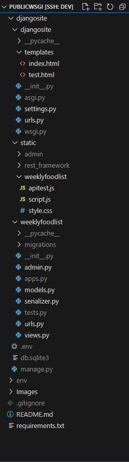

# WeeklyFoodList 🫚

This is a hobby project I'm building for my household to use. I wanted create a service that shuffles foods and picks something to eat every week. And since I've been into coding as a side hobby lately, I decided to give this a try. I wanted to understand how backend and frontend go together which is why I'm trying to create a Django backend with JavaScript frontend.

I decided to upload this into my GitHub mainly for "backup" and documentation purposes because the project is at a point where it kinda works. It's not secure or polished by any means but I'll will be adding some features I'd like this project to have and maybe try to learn about securing fullstack projects.

# How does it work? / My setup

## Structure

This is the structure as seen from VSCode:



And since it's kinda hard to read, here's a tree of the project with some things filtered out.

``` 
(env) vagrant@dev:~/publicwsgi$ tree djangosite/ -a -I '*.pyc' -I 'migrations'
djangosite/
├── .env        #THIS IS WHERE SECRETS ARE STORED IE: SECRET_KEY FOR SETTINGS
├── db.sqlite3  #DATABASE FILE
├── djangosite
│   ├── __init__.py
│   ├── __pycache__
│   ├── asgi.py
│   ├── settings.py
│   ├── templates
│   │   ├── index.html
│   │   └── test.html
│   ├── urls.py
│   └── wsgi.py
├── manage.py
├── static      #STATIC FILES
│   ├── admin   #ADMIN STATIC FILES
│   │   ├── css
│   │   │   ├── autocomplete.css
│   │   │   ├── base.css
│   │   │   ├── changelists.css
│   │   │   ├── dark_mode.css
│   │   │   ├── dashboard.css
│   │   │   ├── forms.css
│   │   │   ├── login.css
│   │   │   ├── nav_sidebar.css
│   │   │   ├── responsive.css
│   │   │   ├── responsive_rtl.css
│   │   │   ├── rtl.css
│   │   │   ├── unusable_password_field.css
│   │   │   ├── vendor
│   │   │   │   └── select2
│   │   │   │       ├── LICENSE-SELECT2.md
│   │   │   │       ├── select2.css
│   │   │   │       └── select2.min.css
│   │   │   └── widgets.css
│   │   ├── img
│   │   │   ├── LICENSE
│   │   │   ├── README.txt
│   │   │   ├── calendar-icons.svg
│   │   │   ├── gis
│   │   │   │   ├── move_vertex_off.svg
│   │   │   │   └── move_vertex_on.svg
│   │   │   ├── icon-addlink.svg
│   │   │   ├── icon-alert.svg
│   │   │   ├── icon-calendar.svg
│   │   │   ├── icon-changelink.svg
│   │   │   ├── icon-clock.svg
│   │   │   ├── icon-deletelink.svg
│   │   │   ├── icon-hidelink.svg
│   │   │   ├── icon-no.svg
│   │   │   ├── icon-unknown-alt.svg
│   │   │   ├── icon-unknown.svg
│   │   │   ├── icon-viewlink.svg
│   │   │   ├── icon-yes.svg
│   │   │   ├── inline-delete.svg
│   │   │   ├── search.svg
│   │   │   ├── selector-icons.svg
│   │   │   ├── sorting-icons.svg
│   │   │   ├── tooltag-add.svg
│   │   │   └── tooltag-arrowright.svg
│   │   └── js
│   │       ├── SelectBox.js
│   │       ├── SelectFilter2.js
│   │       ├── actions.js
│   │       ├── admin
│   │       │   ├── DateTimeShortcuts.js
│   │       │   └── RelatedObjectLookups.js
│   │       ├── autocomplete.js
│   │       ├── calendar.js
│   │       ├── cancel.js
│   │       ├── change_form.js
│   │       ├── core.js
│   │       ├── filters.js
│   │       ├── inlines.js
│   │       ├── jquery.init.js
│   │       ├── nav_sidebar.js
│   │       ├── popup_response.js
│   │       ├── prepopulate.js
│   │       ├── prepopulate_init.js
│   │       ├── theme.js
│   │       ├── unusable_password_field.js
│   │       ├── urlify.js
│   │       └── vendor
│   │           ├── jquery
│   │           │   ├── LICENSE.txt
│   │           │   ├── jquery.js
│   │           │   └── jquery.min.js
│   │           ├── select2
│   │           │   ├── LICENSE.md
│   │           │   ├── i18n
│   │           │   │   ├── af.js
│   │           │   │   ├── ar.js
│   │           │   │   ├── az.js
│   │           │   │   ├── bg.js
│   │           │   │   ├── bn.js
│   │           │   │   ├── bs.js
│   │           │   │   ├── ca.js
│   │           │   │   ├── cs.js
│   │           │   │   ├── da.js
│   │           │   │   ├── de.js
│   │           │   │   ├── dsb.js
│   │           │   │   ├── el.js
│   │           │   │   ├── en.js
│   │           │   │   ├── es.js
│   │           │   │   ├── et.js
│   │           │   │   ├── eu.js
│   │           │   │   ├── fa.js
│   │           │   │   ├── fi.js
│   │           │   │   ├── fr.js
│   │           │   │   ├── gl.js
│   │           │   │   ├── he.js
│   │           │   │   ├── hi.js
│   │           │   │   ├── hr.js
│   │           │   │   ├── hsb.js
│   │           │   │   ├── hu.js
│   │           │   │   ├── hy.js
│   │           │   │   ├── id.js
│   │           │   │   ├── is.js
│   │           │   │   ├── it.js
│   │           │   │   ├── ja.js
│   │           │   │   ├── ka.js
│   │           │   │   ├── km.js
│   │           │   │   ├── ko.js
│   │           │   │   ├── lt.js
│   │           │   │   ├── lv.js
│   │           │   │   ├── mk.js
│   │           │   │   ├── ms.js
│   │           │   │   ├── nb.js
│   │           │   │   ├── ne.js
│   │           │   │   ├── nl.js
│   │           │   │   ├── pl.js
│   │           │   │   ├── ps.js
│   │           │   │   ├── pt-BR.js
│   │           │   │   ├── pt.js
│   │           │   │   ├── ro.js
│   │           │   │   ├── ru.js
│   │           │   │   ├── sk.js
│   │           │   │   ├── sl.js
│   │           │   │   ├── sq.js
│   │           │   │   ├── sr-Cyrl.js
│   │           │   │   ├── sr.js
│   │           │   │   ├── sv.js
│   │           │   │   ├── th.js
│   │           │   │   ├── tk.js
│   │           │   │   ├── tr.js
│   │           │   │   ├── uk.js
│   │           │   │   ├── vi.js
│   │           │   │   ├── zh-CN.js
│   │           │   │   └── zh-TW.js
│   │           │   ├── select2.full.js
│   │           │   └── select2.full.min.js
│   │           └── xregexp
│   │               ├── LICENSE.txt
│   │               ├── xregexp.js
│   │               └── xregexp.min.js
│   ├── rest_framework      #REST_FRAMEWORK STATIC FILES
│   │   ├── css
│   │   │   ├── bootstrap-theme.min.css
│   │   │   ├── bootstrap-theme.min.css.map
│   │   │   ├── bootstrap-tweaks.css
│   │   │   ├── bootstrap.min.css
│   │   │   ├── bootstrap.min.css.map
│   │   │   ├── default.css
│   │   │   ├── font-awesome-4.0.3.css
│   │   │   └── prettify.css
│   │   ├── docs
│   │   │   ├── css
│   │   │   │   ├── base.css
│   │   │   │   ├── highlight.css
│   │   │   │   └── jquery.json-view.min.css
│   │   │   ├── img
│   │   │   │   ├── favicon.ico
│   │   │   │   └── grid.png
│   │   │   └── js
│   │   │       ├── api.js
│   │   │       ├── highlight.pack.js
│   │   │       └── jquery.json-view.min.js
│   │   ├── fonts
│   │   │   ├── fontawesome-webfont.eot
│   │   │   ├── fontawesome-webfont.svg
│   │   │   ├── fontawesome-webfont.ttf
│   │   │   ├── fontawesome-webfont.woff
│   │   │   ├── glyphicons-halflings-regular.eot
│   │   │   ├── glyphicons-halflings-regular.svg
│   │   │   ├── glyphicons-halflings-regular.ttf
│   │   │   ├── glyphicons-halflings-regular.woff
│   │   │   └── glyphicons-halflings-regular.woff2
│   │   ├── img
│   │   │   ├── glyphicons-halflings-white.png
│   │   │   ├── glyphicons-halflings.png
│   │   │   └── grid.png
│   │   └── js
│   │       ├── ajax-form.js
│   │       ├── bootstrap.min.js
│   │       ├── coreapi-0.1.1.js
│   │       ├── csrf.js
│   │       ├── default.js
│   │       ├── jquery-3.7.1.min.js
│   │       ├── load-ajax-form.js
│   │       └── prettify-min.js
│   └── weeklyfoodlist      #MY APP'S STATIC FILES
│       ├── apitest.js
│       ├── script.js
│       └── style.css
└── weeklyfoodlist      #THE APP DIR
    ├── __init__.py
    ├── __pycache__
    ├── admin.py
    ├── apps.py
    ├── models.py
    ├── serializer.py
    ├── tests.py
    ├── urls.py
    └── views.py

30 directories, 184 files
```

On top of this there env/, .gitignore, Images, README.md and requirements.txt like you can see from the image before the tree. env/ -> python virtual environment and .gitignore files/directories I don't want to push to github.

## My setup

I'm running this on a vagrant virtual machine running Debian 12. To develop inside the VM, I connect via SSH with VSCode and use the VSCode like I normally would. This is possible with a VSCode server. To be able to connect via SSH straight you have to add lines to your .ssh/config. I just used `vagrant ssh-config` to gather the lines it uses when using the `vagrant ssh` command and pasted them into .ssh/config. The line you absolutely need is the "IdentityFile" line. Of course add the address, port, name etc. When the IdentityFile has been added to the .ssh/config file you can use `ssh user@hostname` instead of being in the correct dir and using `vagrant ssh`.

I've configured Apache to host this django application and I use a virtualenv to keep the projects needed stuff in a manageable space.

Since I wanted to upload things into GitHub, I needed to make sure that sensitive information from settings and the project don't get pushed. I use .gitignore to push only the essential files and not files that are auto generated or have open sensitive information. I use dotenv to store secrets into .env file and use them as global variables.

## The site overview

This is what the frontpage looks like:


The button creates a list with one fish dish, one soup dish and the rest is whatever:


A popup showing the food's description.


This is the API root:


And this is the food API:


The default admin login:


Admin frontpage:


And some foods we've added to the database:


## Some things to note

If you decide to use these files you have to create a Django project, configure a web server, configure venv (optional but recommended), create a Django app, configure dotenv or remove dotenv and use the lines from your settings, collect static files and populate the database yourself. Then you can use these files.

## The files

### settings.py

If you don't want to use dotenv you can remove lines `from dotenv import load_dotenv`, `load_dotenv()`, `str(os.getenv('SECRET_KEY'))` and `bool(os.getenv('DEBUG'))`. Remember to add `SECRET_KEY = 'your secret key'` and `DEBUG = value`.

### Project urls.py

This file has the original setting and a test setting commented out. The test setting is from rest_framework's pypi site.

### admin.py

This file controls what models the admin panel has and how the models' values are displayed.

### models.py

This file creates a database schema. This uses ORM (Object Relational Mapping) and models.py represents tables and attributes.

### serializer.py

This file handles the change from models to JSON data. Deserializing turns JSON data into models. When a GET request is made to the api the serializer must turn the Food from python model to JSON data for the frontend to read and parse. When a POST request is made the frontend sends JSON data and the serializer must deserialize the JSON into python model data.

### App urls.py

This only has the frontpage view setup.

### views.py

This configures request to the frontpage to use the index.html template. The viewset from the rest_framework. It manages what actions can be done in the API. Viewsets work with the project urls.py to dynamically create routes for different views/actions. I really don't know how to explain this...

### Templates index.html

This is the html of the frontpage. The style.css and script.js are linked to it.

### Static style.css

A css file that makes the site look better.

### Static script.js

The client side JavaScript code that fetches the data from the API on window load and then suffles the list on a click of a button. I'm really just a beginner in JavaScript which is why the code might be meh but it works or atleast I think it works.

### Static apitest.js and Templates test.html

These were only for testing purposes.

### requirements.txt

To install all at once `pip install -r requirements.txt`. Remove dotenv if you are not going to use it.